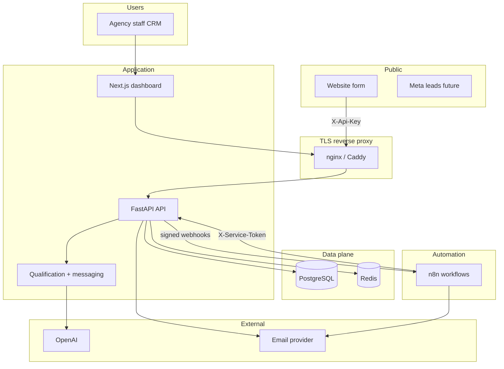
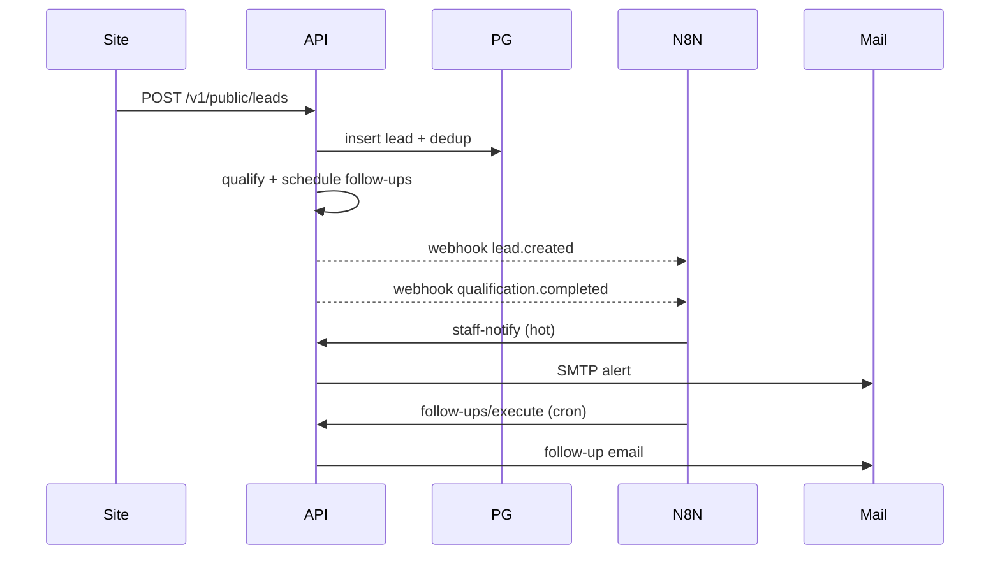

# LeadFlow architecture diagram

```mermaid
flowchart TB
  subgraph public [Public]
    Form[Website form]
    Meta[Meta leads future]
  end

  subgraph users [Users]
    Agent[Agency staff CRM]
  end

  subgraph edge [TLS reverse proxy]
    RP[nginx / Caddy]
  end

  subgraph app [Application]
    WEB[Next.js dashboard]
    API[FastAPI API]
    AI[Qualification + messaging]
  end

  subgraph data [Data plane]
    PG[(PostgreSQL)]
    RD[(Redis)]
  end

  subgraph auto [Automation]
    N8N[n8n workflows]
  end

  subgraph external [External]
    OAI[OpenAI]
    SMTP[Email provider]
  end

  Form -->|X-Api-Key| RP
  Agent --> WEB
  WEB --> RP
  RP --> API
  API --> PG
  API --> RD
  API --> AI
  AI --> OAI
  API -->|signed webhooks| N8N
  N8N -->|X-Service-Token| API
  API --> SMTP
  N8N --> SMTP
```

## Request flows

```mermaid
sequenceDiagram
  participant Site
  participant API
  participant PG
  participant N8N
  participant Mail

  Site->>API: POST /v1/public/leads
  API->>PG: insert lead + dedup
  API->>API: qualify + schedule follow-ups
  API-->>N8N: webhook lead.created
  API-->>N8N: webhook qualification.completed
  N8N->>API: staff-notify (hot)
  API->>Mail: SMTP alert
  N8N->>API: follow-ups/execute (cron)
  API->>Mail: follow-up email
```

See also [architecture.md](architecture.md), [n8n-workflows.md](n8n-workflows.md), [email-followups.md](email-followups.md).